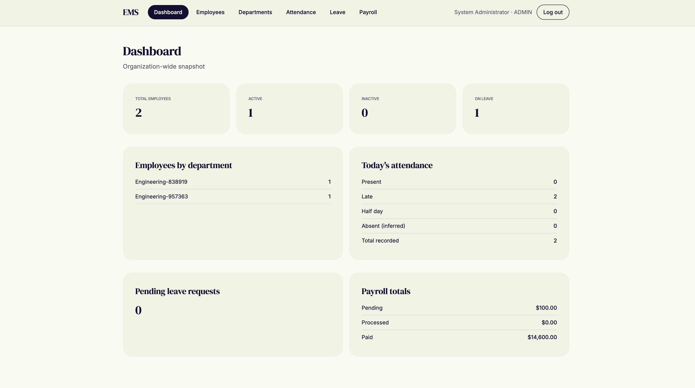

# Employee Management System (EMS)

A production-quality Employee Management System with a Java/Spring Boot backend and a React SPA frontend.

## Screenshots

### Dashboard



## Tech Stack

Backend:
- Java 21, Spring Boot 3.3
- Spring Data JPA / Hibernate
- Spring Security + JWT (jjwt)
- PostgreSQL + Flyway migrations
- Bean Validation
- springdoc-openapi (Swagger UI)
- JUnit 5, Mockito, Spring Boot Test, MockMvc
- Docker / Docker Compose

Frontend (`frontend/`):
- React 19, TypeScript, Vite
- Tailwind CSS v4, custom warm cream/meadow theme
- React Router
- A typed API client that preserves the backend's response envelope (`ApiResponse`/`PagedResponse`/`ErrorResponse`) rather than reshaping it client-side

## Architecture

Modular monolith with a domain-oriented package structure. Each module follows:

```
Controller -> DTO -> Service -> Repository -> Entity -> PostgreSQL
```

Modules: `auth`, `employee`, `department`, `attendance`, `leave`, `payroll`, `dashboard`, plus shared `common` and `config` packages. Entities are never returned directly from controllers; every endpoint uses request/response DTOs.

## Getting Started

### Option 1: Docker Compose (recommended)

```bash
cp .env.example .env
# edit .env and set JWT_SECRET (32+ chars) and DATABASE_PASSWORD
docker compose up --build
```

The application will be available at `http://localhost:8080`. Flyway runs migrations automatically on startup — no manual database setup required.

Swagger UI: `http://localhost:8080/swagger-ui.html`

### Option 2: Local development

Requires Java 21, Maven, and a running PostgreSQL instance.

```bash
export DATABASE_URL=jdbc:postgresql://localhost:5432/ems_db
export DATABASE_USERNAME=ems_user
export DATABASE_PASSWORD=ems_password
export JWT_SECRET=a-local-development-secret-that-is-at-least-32-characters
mvn spring-boot:run
```

### Bootstrapping an administrator

On startup, if `ADMIN_EMAIL` and `ADMIN_PASSWORD` are set and no such account exists, the application creates a single ADMIN user automatically. Otherwise, register via `/api/v1/auth/register` (defaults to the `EMPLOYEE` role) and promote the account directly in the database, or seed it in a migration for your environment.

### Frontend

```bash
cd frontend
npm install
npm run dev
```

Opens at `http://localhost:5173` and proxies `/api/*` to the backend (defaults to `http://localhost:8081`; override with `VITE_API_PROXY_TARGET`). Make sure the backend's `CORS_ALLOWED_ORIGINS` includes `http://localhost:5173` — the dev proxy makes requests same-origin from the browser, but the backend still evaluates CORS against the real `Origin` header on every request and will 403 it otherwise.

## Roles

| Role | Access |
|------|--------|
| `ADMIN` | Full system access |
| `HR` | Manage employees, departments, attendance, leave, payroll |
| `MANAGER` | Employees/attendance/leave scoped to their own department |
| `EMPLOYEE` | Own profile, attendance, leave requests, payroll |

## API Overview

All endpoints are versioned under `/api/v1`. Full interactive documentation is available via Swagger UI once the app is running.

- `POST /api/v1/auth/register`, `/login`, `/refresh`, `GET /api/v1/auth/me`
- `GET/POST/PUT/DELETE/PATCH /api/v1/employees[...]`
- `GET/POST/PUT/DELETE /api/v1/departments[...]`
- `POST /api/v1/attendance/check-in`, `/check-out`, `GET /api/v1/attendance[...]`
- `GET/POST /api/v1/leave-requests`, `PUT .../approve|reject|cancel`
- `GET/POST/PUT/DELETE /api/v1/payroll[...]`
- `GET /api/v1/dashboard/summary`

### Response format

Success:

```json
{ "success": true, "data": { }, "message": "Operation completed successfully" }
```

Paginated:

```json
{ "success": true, "data": [ ], "pagination": { "page": 0, "size": 20, "totalElements": 100, "totalPages": 5 } }
```

Error:

```json
{ "success": false, "error": { "code": "EMPLOYEE_NOT_FOUND", "message": "Employee not found" }, "timestamp": "...", "path": "..." }
```

## Testing

```bash
mvn test
```

Tests use an in-memory H2 database (Postgres compatibility mode) and cover authentication, authorization, employee/department CRUD, attendance rules, leave approval workflows, payroll calculations, validation, and exception handling.

## Configuration

All secrets and environment-specific values are supplied via environment variables (see `.env.example`); nothing sensitive is committed to source control. Spring profiles: `development`, `production`, `test`.
